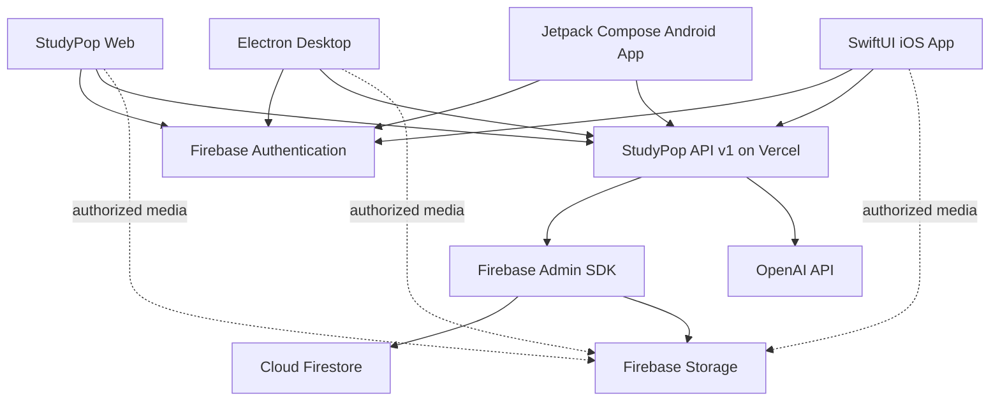

# StudyPop Cross-Platform App Plan

## 1. Goal

Turn StudyPop into a coordinated product with four clients:

1. **Web app** - the existing Vercel application.
2. **Desktop app** - an Electron application, beginning with Windows.
3. **iOS app** - a native SwiftUI application for iPhone and iPad.
4. **Android app** - a native Kotlin and Jetpack Compose application.

All clients will use the same user accounts, conversations, study kits, media,
preferences, progress, AI features, and backend. A user should be able to start
working on one device and continue on another.

## 2. Recommended Product Decisions

These defaults keep the first release focused:

- Keep the existing StudyPop visual identity and companion system.
- Use Firebase Authentication for every client.
- Use Cloud Firestore for persistent user data and cross-device sync.
- Use Firebase Storage for question images, camera captures, and temporary
  voice recordings.
- Keep OpenAI requests on the backend. Never include the OpenAI key in a web,
  Electron, or iOS build.
- Keep Vercel as the public API host for the first production version.
- Ship Windows Electron first. Add a signed macOS build after the Windows
  release is stable.
- Build the iOS app with SwiftUI and support iOS 17 or newer for the first
  release.
- Start with email/password authentication. Add Sign in with Apple and Google
  after the shared account system is stable.
- Make online use the first launch requirement. Add carefully defined offline
  behavior after cross-device synchronization is reliable.

## 3. Current State

StudyPop currently has:

- A browser frontend in `src/app.js` and `src/styles.css`.
- A Node backend in `server.mjs`.
- A Vercel serverless adapter in `api/index.mjs`.
- OpenAI-powered answer, study-kit, and transcription endpoints.
- Browser and Windows-specific microphone and camera behavior.
- Local signup, login, sessions, and saved state.
- A production deployment at `https://studypop-flame.vercel.app`.

### Current production limitation

The existing account and state system stores users in a local JSON file and
sessions in server memory. On Vercel, local writable data lives under `/tmp`
and is temporary. That means the current system cannot reliably provide:

- Persistent accounts.
- Cross-device login.
- Conversation synchronization.
- Durable study kits.
- Safe horizontal scaling across serverless instances.

This must be fixed before Electron and iOS are released.

## 4. Target Architecture



### Responsibility boundaries

| Layer | Responsibility |
| --- | --- |
| Clients | Interface, media capture, local drafts, Firebase sign-in, displaying results |
| Firebase Auth | Shared identity, token refresh, password reset, sign-in providers |
| Vercel API | Authorization, validation, AI orchestration, quotas, application rules |
| Firestore | Persistent synchronized app data |
| Firebase Storage | Private user-owned image and audio files |
| OpenAI | Answering, explaining, summarizing, generating flashcards and quizzes, transcription |

## 5. Proposed Repository Layout

Move gradually toward a monorepo without breaking the live web app:

```text
StudyPop/
  apps/
    web/
      src/
      public/
    desktop/
      src/
        main/
        preload/
        renderer/
      electron-builder.yml
    ios/
      StudyPop.xcodeproj
      StudyPop/
        App/
        Features/
        Services/
        Models/
        DesignSystem/
  backend/
    api/
    src/
      auth/
      ai/
      conversations/
      study/
      media/
  packages/
    contracts/
      openapi.yaml
      schemas/
    web-core/
      api/
      auth/
      state/
    design-tokens/
  firebase/
    firestore.rules
    firestore.indexes.json
    storage.rules
  docs/
  package.json
```

The move should happen in stages. Do not relocate every current file before
the backend migration has tests.

## 6. Shared Backend Foundation

### 6.1 Firebase Authentication

Implement Firebase Authentication in the web app first, then use the same
Firebase project in Electron and iOS.

Required work:

- Enable Email/Password in Firebase Authentication.
- Add password reset and email verification.
- Create Firebase client initialization for web/Electron.
- Add the Firebase Apple SDK to iOS through Swift Package Manager.
- Replace `/api/signup`, `/api/login`, `/api/logout`, and cookie-based sessions.
- Attach the Firebase ID token to API calls:

```http
Authorization: Bearer <firebase-id-token>
```

- Add Firebase Admin SDK middleware to the Vercel API.
- Verify the token and use its trusted `uid` as the user identity.
- Reject expired, invalid, or missing tokens with consistent `401` responses.
- Never trust a `uid` submitted in a request body.

### 6.2 Firestore Data Model

Use subcollections so conversations and messages can grow without reaching a
single-document size limit.

```text
users/{uid}
  displayName
  email
  photoURL
  createdAt
  updatedAt

users/{uid}/preferences/app
  theme
  selectedCompanion
  accessibility
  notificationSettings
  updatedAt

users/{uid}/conversations/{conversationId}
  section
  title
  lastMessagePreview
  createdAt
  updatedAt
  archivedAt

users/{uid}/conversations/{conversationId}/messages/{messageId}
  role
  text
  mediaIds
  status
  clientRequestId
  createdAt

users/{uid}/studyKits/{studyKitId}
  title
  sourceText
  summary
  flashcards
  quiz
  mediaIds
  createdAt
  updatedAt

users/{uid}/progress/{subjectId}
  streak
  questionsAnswered
  studyKitsCompleted
  lastStudiedAt

users/{uid}/media/{mediaId}
  kind
  storagePath
  contentType
  size
  status
  createdAt
```

Use Firestore server timestamps for all canonical timestamps. Store messages
as append-only records where possible.

### 6.3 Firebase Storage

Use private paths owned by the signed-in user:

```text
users/{uid}/images/{mediaId}.{extension}
users/{uid}/audio/{mediaId}.{extension}
```

Rules and validation:

- A user may only read or write files beneath their own `uid`.
- Allow only approved MIME types.
- Enforce size limits in both Storage rules and backend validation.
- Strip unnecessary image metadata before long-term storage where practical.
- Do not create permanent public download URLs.
- Store file metadata in Firestore and verify ownership before AI processing.
- Add a cleanup job for abandoned uploads and temporary audio.

Recommended initial limits:

- Images: 10 MB each.
- Audio: 25 MB each.
- Maximum attachments per question: 5.
- Normalize large images before sending them to OpenAI.

### 6.4 Versioned API

Move application endpoints under `/api/v1`. Preserve old routes temporarily
as compatibility adapters while the web client migrates.

Suggested API:

```text
GET    /api/v1/me
GET    /api/v1/preferences
PATCH  /api/v1/preferences

GET    /api/v1/conversations
POST   /api/v1/conversations
GET    /api/v1/conversations/:id
DELETE /api/v1/conversations/:id
GET    /api/v1/conversations/:id/messages
POST   /api/v1/conversations/:id/messages

GET    /api/v1/study-kits
POST   /api/v1/study-kits
GET    /api/v1/study-kits/:id
PATCH  /api/v1/study-kits/:id
DELETE /api/v1/study-kits/:id

POST   /api/v1/media
POST   /api/v1/media/:id/complete
DELETE /api/v1/media/:id

POST   /api/v1/ai/answer
POST   /api/v1/ai/study-kit
POST   /api/v1/ai/transcribe
```

API requirements:

- Publish an OpenAPI contract.
- Return one shared error shape on every platform.
- Validate request and response payloads with schemas.
- Use cursor pagination for conversations and messages.
- Give mutating requests an idempotency key or `clientRequestId`.
- Add request IDs to responses and logs.
- Set explicit API timeouts.
- Add per-user rate limits and AI usage limits.
- Restrict allowed origins for browser traffic.
- Keep API responses platform-neutral.

Suggested error shape:

```json
{
  "error": {
    "code": "VALIDATION_ERROR",
    "message": "Please add a question or an image.",
    "requestId": "req_123",
    "details": {}
  }
}
```

### 6.5 OpenAI Integration

Keep all OpenAI calls in the backend:

- The clients send text and private media references to StudyPop's API.
- The backend verifies the user's ownership of every media item.
- The backend calls the appropriate OpenAI endpoint.
- The backend saves the completed assistant message or study kit.
- The same result is then available on every signed-in device.

Improve reliability with:

- Structured output schemas for summaries, flashcards, and quizzes.
- A shared system prompt for easy, age-appropriate explanations.
- Subject-specific prompt policies for Math, Biology, History, and other rooms.
- Normalized math notation using familiar symbols.
- Retry rules for transient failures only.
- Moderation and abuse controls.
- Token, image, and transcription usage accounting per user.
- Streaming answers in a later phase after the non-streaming contract is stable.

## 7. Cross-Device Synchronization

### Synchronization rules

- **Preferences:** last valid write wins, using `updatedAt`.
- **Messages:** append-only with unique client-generated IDs.
- **Study kits:** server is authoritative after generation; user edits use a
  document version.
- **Progress:** update with Firestore transactions or atomic increments.
- **Uploads:** use a state machine: `pending`, `uploaded`, `processing`,
  `ready`, or `failed`.
- **Deleted records:** use soft deletion first so other clients can synchronize
  the deletion before permanent cleanup.

### Retry and duplicate protection

Every client creates a UUID for an action before sending it. The backend stores
that ID and returns the existing result if a retry repeats the same action.
This prevents duplicate questions, charges, or messages after a connection
failure.

### Offline behavior

First release:

- Users can view recently cached content.
- Draft text remains on the device.
- AI questions require a connection.
- Media capture can be saved as a local draft.
- The interface clearly shows offline, syncing, and failed states.

Later release:

- Queue message and media submissions.
- Resume uploads.
- Reconcile edits using document versions.
- Let users manually retry or discard failed actions.

Do not promise full offline AI answering because model calls require the
backend.

## 8. Web App Work

The web app becomes the reference client for the shared contracts.

Required changes:

- Split `src/app.js` into feature modules.
- Add a reusable authenticated API client.
- Replace local session calls with Firebase Auth state listeners.
- Move state persistence from `/api/state` to Firestore/API resources.
- Keep camera capture through browser media APIs.
- Keep browser recording through `MediaRecorder`.
- Add upload progress, cancellation, retry, and clear permission guidance.
- Add route-based login, signup, password reset, and verification pages.
- Preserve responsive layouts so the same renderer can be reused by Electron.
- Add a visible synchronization status.
- Add account deletion and data export entry points.

## 9. Electron Desktop Plan

### 9.1 Application approach

Reuse the web presentation and feature modules in the Electron renderer. The
renderer should call the same public API as the web app. Platform-specific
features go through a small native adapter.

Electron processes:

- **Main process:** windows, lifecycle, updates, permissions, native dialogs.
- **Preload script:** exposes narrowly scoped capabilities.
- **Renderer:** StudyPop interface with no direct Node.js access.

Example adapter surface:

```ts
interface StudyPopPlatform {
  chooseImages(): Promise<SelectedFile[]>;
  capturePhoto(): Promise<CapturedPhoto>;
  startRecording(): Promise<void>;
  stopRecording(): Promise<RecordedAudio>;
  setFlashlight(enabled: boolean): Promise<PlatformResult>;
  showNotification(input: NotificationInput): Promise<void>;
}
```

The web implementation uses browser APIs. Electron uses IPC implemented by
the preload and main process. iOS implements equivalent Swift protocols.

### 9.2 Electron security

Required settings:

- `nodeIntegration: false`
- `contextIsolation: true`
- Renderer sandbox enabled.
- A strict Content Security Policy.
- No remote content with Node.js privileges.
- Expose individual preload methods, not raw IPC.
- Validate every IPC sender and argument.
- Deny unexpected navigation and new windows.
- Open approved external links in the system browser.
- Allowlist API and Firebase endpoints.
- Store no OpenAI or Firebase Admin credentials in the desktop package.
- Apply Electron updates promptly.

### 9.3 Desktop media

- Use Electron permission handlers for microphone and camera.
- Provide a device selector when multiple microphones/cameras exist.
- Use the Chromium media APIs where they work consistently.
- Keep native Windows speech scripts only as a temporary fallback.
- Save recordings to the application temporary directory, upload, then delete.
- Explain operating-system permission steps when access is denied.
- A desktop computer normally cannot control a physical flashlight. Show the
  flashlight control only when the active camera/device reports torch support.

### 9.4 Packaging and distribution

Recommended tooling:

- Electron Forge or Electron Builder.
- Windows installer: signed `.exe`/NSIS or MSIX.
- Auto-update channel with stable and beta releases.
- Crash reporting through Sentry or a comparable service.

Release requirements:

- Purchase and protect a Windows code-signing certificate.
- Sign installers and update packages.
- Publish checksums and release notes.
- Build in CI from tagged commits.
- Add macOS signing and notarization only when macOS distribution begins.

## 10. Native iOS Plan

### 10.1 Technology

- Swift 6-compatible codebase.
- SwiftUI for the interface.
- Structured concurrency with `async/await`.
- Firebase Apple SDK through Swift Package Manager.
- `URLSession` for StudyPop API requests.
- `PhotosPicker` for library uploads.
- `AVFoundation` for recording and camera capture.
- XCTest for unit/integration tests.
- XCUITest for critical user journeys.

Recommended modules:

```text
App
DesignSystem
Authentication
Home
SubjectRooms
Conversation
StudyKit
MediaCapture
Companions
Settings
Networking
Persistence
Analytics
```

### 10.2 iOS feature mapping

| StudyPop feature | iOS implementation |
| --- | --- |
| Type a question | SwiftUI text editor |
| Upload images | PhotosPicker |
| Snap a picture | AVCaptureSession or camera picker |
| Record voice | AVAudioRecorder/AVAudioEngine |
| Flashlight | AVCaptureDevice torch when available |
| Follow-up questions | Conversation screen using shared conversation IDs |
| Study summaries | Native study-kit view |
| Flashcards | Swipe/tap SwiftUI card interface |
| Quizzes | Native question flow with progress |
| Companions | Bundled optimized assets and shared companion IDs |
| Themes | Shared semantic design tokens mapped to Swift colors |

### 10.3 Authentication

- Configure the iOS bundle ID in Firebase.
- Add `GoogleService-Info.plist` through environment-specific build settings.
- Use Firebase Auth for signup, login, logout, password reset, and token refresh.
- Obtain the Firebase ID token before protected API calls.
- Let the Firebase SDK store credentials securely.
- Add Sign in with Apple when third-party social login is introduced.
- Support account deletion inside the app.

### 10.4 Permissions and privacy

Add clear usage descriptions for:

- Camera.
- Microphone.
- Photo library.
- Notifications, if reminders are enabled.

The app must:

- Ask only when the feature is used.
- Explain how to re-enable denied access in Settings.
- Avoid recording before the user deliberately starts it.
- Show a visible recording state.
- Stop capture when the app moves to the background.
- Delete temporary local media after upload or cancellation.
- Include a privacy policy and data deletion process.

### 10.5 iOS release

Requirements:

- A Mac capable of running the current supported Xcode.
- An Apple Developer Program membership.
- App Store Connect app record.
- Distribution certificates and provisioning managed by Xcode or CI.
- TestFlight internal testing, then external beta testing.
- App privacy answers and required reason API declarations.
- App Store screenshots, description, support URL, and privacy policy URL.

## 11. Shared Design System

The three clients should feel like the same product without forcing native iOS
to render the web interface.

Create platform-neutral design tokens:

```json
{
  "colors": {
    "primary": "#...",
    "surface": "#...",
    "text": "#..."
  },
  "spacing": {
    "small": 8,
    "medium": 16,
    "large": 24
  },
  "radius": {
    "card": 20,
    "button": 14
  }
}
```

Share:

- Theme names and semantic color meanings.
- Companion IDs, names, image assets, and encouragement text.
- Subject IDs and icons.
- Terminology and empty-state wording.
- API models and validation rules.

Do not share:

- Electron IPC implementation with iOS.
- Browser DOM code with SwiftUI.
- Platform permission logic.

All companion images must have documented usage rights before App Store or
commercial distribution. Replace copyrighted character images or names with
original StudyPop companions unless appropriate licenses have been obtained.

## 12. Security and Privacy Checklist

- OpenAI and Firebase Admin secrets exist only in backend environment variables.
- Separate development, staging, and production Firebase projects.
- Verify Firebase ID tokens on every protected backend request.
- Authorize each Firestore and Storage operation by `uid`.
- Deploy restrictive Firestore and Storage rules.
- Enable Firebase App Check after initial integration.
- Validate file signatures, types, dimensions, and sizes.
- Rate-limit authentication and AI endpoints.
- Set per-user spending and usage limits.
- Redact tokens, passwords, and question content from logs.
- Encrypt traffic with HTTPS.
- Add dependency and secret scanning in CI.
- Define data retention for audio, images, messages, and deleted accounts.
- Provide privacy policy, terms, data export, and account deletion.
- Review child safety and age-related legal requirements before targeting
  children or collecting their personal data.

## 13. Environments and Configuration

Create three isolated environments:

| Environment | Purpose |
| --- | --- |
| Development | Local development and disposable test data |
| Staging | Integration tests, TestFlight, Electron beta |
| Production | Real users and billing |

Each environment needs:

- A separate Firebase project.
- A separate Vercel project or environment configuration.
- Separate OpenAI project keys and budgets.
- Distinct iOS bundle IDs.
- Distinct Electron update channels.
- Environment-specific Firebase configuration.

Public Firebase client configuration is not a server secret, but Admin
credentials and OpenAI keys are secrets and must never be committed.

## 14. Testing Strategy

### Backend

- Unit tests for validation, authorization, prompts, and data mapping.
- Integration tests against Firebase Emulator Suite.
- Contract tests generated from the OpenAPI specification.
- Tests for expired tokens, wrong-user media IDs, duplicate requests, quotas,
  and OpenAI failures.

### Web

- Unit tests for state and API modules.
- Playwright tests for signup, login, question, follow-up, study kit, upload,
  recording, camera capture, and logout.
- Permission-denied and network-failure tests.

### Electron

- Renderer tests shared with web where possible.
- Main/preload IPC tests.
- Playwright Electron tests for login, media, updates, and external links.
- Installer tests on clean Windows virtual machines.

### iOS

- XCTest for models, API client, repositories, and sync behavior.
- XCUITest for authentication, conversations, camera, voice, study kits, and
  logout.
- Tests on physical devices, not only the simulator, for camera, microphone,
  torch, interruptions, and background behavior.

### Cross-platform

Test these flows explicitly:

1. Create an account on web and sign in on Electron and iOS.
2. Ask on iOS and continue the conversation on web.
3. Create a study kit on Electron and review it on iOS.
4. Change theme or companion and see the preference on other clients.
5. Delete a conversation and verify it disappears everywhere.
6. Retry a timed-out request without creating duplicate messages.
7. Revoke an account and confirm every client loses access.

## 15. Observability and Operations

- Add structured backend logs with request IDs.
- Add Sentry to web, Electron, backend, and iOS, or use Firebase Crashlytics
  for iOS.
- Track API latency, OpenAI latency, error rate, upload failures, and sync
  failures.
- Add user-level AI usage metrics without logging private question text.
- Create alerts for error spikes, quota exhaustion, and increased AI spend.
- Create an operational dashboard for active users and feature health.
- Document incident response, rollback, and key rotation.

## 16. CI/CD Plan

Use GitHub Actions:

### Pull requests

- Install locked dependencies.
- Lint and test backend/web.
- Validate OpenAPI and Firebase rules.
- Build the web application.
- Build the Electron application without publishing.
- Run iOS tests on a macOS runner.
- Run dependency and secret scans.

### Main branch

- Deploy a Vercel staging or preview build.
- Deploy Firebase staging rules and indexes.
- Publish signed Electron beta artifacts when tagged.
- Upload iOS beta builds to TestFlight through Fastlane or Xcode Cloud.

### Production

- Require manual approval.
- Run database migration checks.
- Deploy backend/web first.
- Run smoke tests.
- Promote Electron and iOS releases only after backend compatibility is proven.
- Keep the previous production versions supported during client rollout.

## 17. Implementation Roadmap

### Phase 0 - Product and account setup

Estimated effort: 2-4 days.

Tasks:

- Confirm Windows-first desktop scope.
- Confirm minimum iOS version.
- Create development, staging, and production environments.
- Enable Firebase Auth, Firestore, and Storage.
- Obtain Apple Developer and code-signing accounts.
- Audit companion image and character licensing.
- Define privacy and data-retention requirements.

Exit criteria:

- Required accounts exist.
- Environment ownership is documented.
- Product and legal decisions do not block implementation.

### Phase 1 - Persistent shared backend

Estimated effort: 2-3 weeks.

Tasks:

- Add Firebase Admin SDK.
- Add bearer-token authentication middleware.
- Create Firestore collections, indexes, and rules.
- Create Storage paths and rules.
- Implement `/api/v1` contracts.
- Move AI routes behind authenticated services.
- Add request validation, idempotency, rate limits, and usage tracking.
- Add Firebase Emulator integration tests.
- Create a one-time migration path for any valuable existing user state.

Exit criteria:

- Accounts and data survive Vercel restarts.
- A test user sees the same data from two independent clients.
- No protected route trusts client-provided user IDs.

### Phase 2 - Web migration and modularization

Estimated effort: 2-3 weeks.

Tasks:

- Replace local authentication with Firebase Auth.
- Replace `/api/state` with shared persistent resources.
- Split the current large frontend script into feature modules.
- Add upload and sync state handling.
- Migrate conversations and study kits.
- Add end-to-end tests.
- Release behind a feature flag, then remove legacy auth.

Exit criteria:

- The production web app uses Firebase identity and persistent storage.
- Existing core StudyPop functionality passes automated browser tests.
- API contracts are stable enough for Electron and iOS.

### Phase 3 - Electron desktop MVP

Estimated effort: 2-3 weeks.

Tasks:

- Scaffold main, preload, and renderer processes.
- Reuse the modular web client.
- Add secure IPC and platform adapters.
- Implement camera, image upload, recording, permissions, and notifications.
- Add packaging, signing, crash reporting, and beta update channel.
- Test the installer on clean Windows machines.

Exit criteria:

- A signed beta installs and updates correctly.
- The user can complete all core StudyPop flows.
- Data created on desktop appears on web and iOS test clients.

### Phase 4 - SwiftUI iOS MVP

Estimated effort: 4-6 weeks.

Tasks:

- Build the SwiftUI design system and navigation.
- Implement Firebase authentication.
- Generate or hand-build Swift models from the API contract.
- Implement conversations and follow-up questions.
- Implement subject rooms and study kits.
- Add PhotosPicker, camera, microphone, and torch support.
- Add permission and failure handling.
- Add unit tests, UI tests, analytics, and crash reporting.
- Release an internal TestFlight build.

Exit criteria:

- Core feature parity is complete.
- Cross-device data synchronization passes.
- Physical-device media testing passes.
- No secrets are present in the app bundle.

### Phase 5 - Synchronization and reliability

Estimated effort: 2-3 weeks.

Tasks:

- Add cached reads and local drafts.
- Add resumable upload/retry behavior.
- Test token expiration and refresh.
- Test simultaneous edits and deletion propagation.
- Tune Firestore indexes and API performance.
- Add usage dashboards and cost alerts.
- Complete accessibility and localization review.

Exit criteria:

- Network interruption does not lose user drafts.
- Retried operations do not duplicate data or AI charges.
- Sync conflicts follow documented rules.

### Phase 6 - Beta and public launch

Estimated effort: 2-4 weeks, excluding unpredictable App Store review time.

Tasks:

- Run Electron beta and TestFlight external beta.
- Fix crash, permission, synchronization, and usability issues.
- Complete privacy policy, terms, support pages, and store materials.
- Perform security review and dependency audit.
- Complete staged production rollout.
- Monitor errors and AI costs daily during launch.

Exit criteria:

- Web, Electron, and iOS meet the same core quality bar.
- Support, monitoring, rollback, and account deletion are operational.
- Public installers and App Store release are approved.

### Overall estimate

For one experienced full-time engineer, a realistic first public release is
approximately **12-20 engineering weeks**, depending on native iOS experience,
design changes, signing/account readiness, and App Store feedback. Parallel
backend, Electron, iOS, and QA work can shorten elapsed time.

## 18. Feature Parity Checklist

| Feature | Web | Electron | iOS | Android |
| --- | --- | --- | --- | --- |
| Signup/login/logout | Required | Required | Required | Required |
| Password reset | Required | Required | Required | Required |
| Subject rooms | Required | Required | Required | Required |
| General questions | Required | Required | Required | Required |
| Follow-up conversation | Required | Required | Required | Required |
| Image upload | Required | Required | Required | Required |
| Camera capture | Required | Required | Required | Required |
| Voice recording | Required | Required | Required | Required |
| AI transcription | Required | Required | Required | Required |
| Study summaries | Required | Required | Required | Required |
| Flashcards | Required | Required | Required | Required |
| Quizzes | Required | Required | Required | Required |
| Companion selection | Required | Required | Required | Required |
| Theme selection | Required | Required | Required | Required |
| Flashlight/torch | When supported | When supported | Required on supported devices | Required on supported devices |
| Cross-device history | Required | Required | Required | Required |
| Local drafts | Required | Required | Required | Required |
| Full offline AI | Not planned | Not planned | Not planned | Not planned |

Android implements the same feature set with Jetpack Compose, CameraX,
MediaRecorder, Android Keystore, and the shared `/api/v1` contract. Its source
lives in `apps/android`, and CI publishes a debug APK artifact on every push.

## 19. Main Risks and Mitigations

| Risk | Mitigation |
| --- | --- |
| Temporary current production storage | Complete Firebase migration before native release |
| Duplicate requests after network failure | Client request IDs and idempotent backend handlers |
| AI cost growth | Per-user quotas, budgets, rate limits, and monitoring |
| Large media uploads | Compression, limits, resumable uploads, cleanup |
| Electron security exposure | Isolated preload API, sandbox, CSP, signed updates |
| iOS permission rejection | Ask in context, explain purpose, test denied states |
| App Store rejection | Privacy compliance, account deletion, licensed assets |
| Copyrighted companion characters | Replace with original/licensed designs before distribution |
| Client/API version mismatch | Versioned API and backward compatibility window |
| Sync conflicts | Explicit per-resource conflict rules and server timestamps |
| No Mac available | Secure Mac hardware or managed macOS CI is required for iOS release |

## 20. Definition of Done

The cross-platform project is complete when:

- One account works on web, Electron, and iOS.
- Conversations, study kits, preferences, and progress synchronize reliably.
- Text, image, camera, and voice questions work on all supported platforms.
- Follow-up questions retain conversation context.
- OpenAI credentials never leave the backend.
- Users can reset passwords, log out, export data, and delete accounts.
- Every client handles denied permissions, expired sessions, offline state,
  retries, and server errors clearly.
- Electron releases are signed and update securely.
- iOS has passed TestFlight testing and App Store review.
- Monitoring, quotas, privacy documents, and support processes are live.

## 21. First Ten Actions

1. Create separate development and staging Firebase projects.
2. Enable Firebase Email/Password Authentication, Firestore, and Storage.
3. Add Firebase Admin authentication middleware to the Vercel API.
4. Write and test Firestore and Storage security rules.
5. Publish the first `/api/v1` OpenAPI contract.
6. Migrate the web app from local sessions to Firebase Auth.
7. Migrate conversations, preferences, and study kits to Firestore.
8. Add backend idempotency, rate limiting, logging, and AI usage tracking.
9. Scaffold the secured Electron application around the modular web client.
10. Create the SwiftUI project and implement authentication plus one end-to-end
    conversation flow against staging.

## 22. Reference Documentation

- Electron security:
  <https://www.electronjs.org/docs/latest/tutorial/security>
- Electron context isolation:
  <https://www.electronjs.org/docs/latest/tutorial/context-isolation>
- Firebase ID token verification:
  <https://firebase.google.com/docs/auth/admin/verify-id-tokens>
- Firestore offline behavior:
  <https://firebase.google.com/docs/firestore/manage-data/enable-offline>
- Apple developer distribution:
  <https://developer.apple.com/distribute/>
